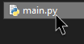
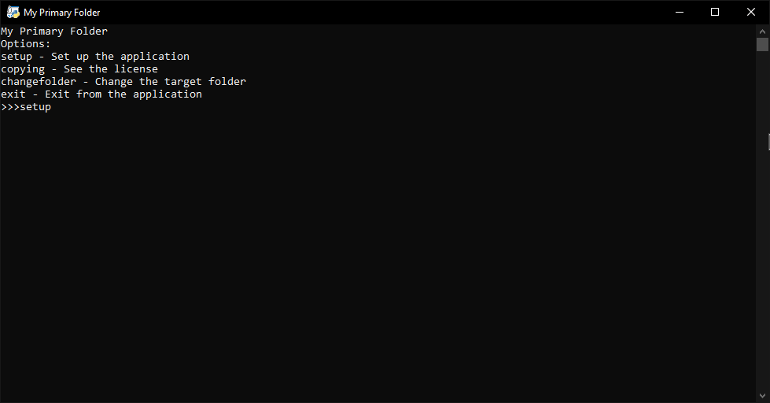
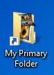
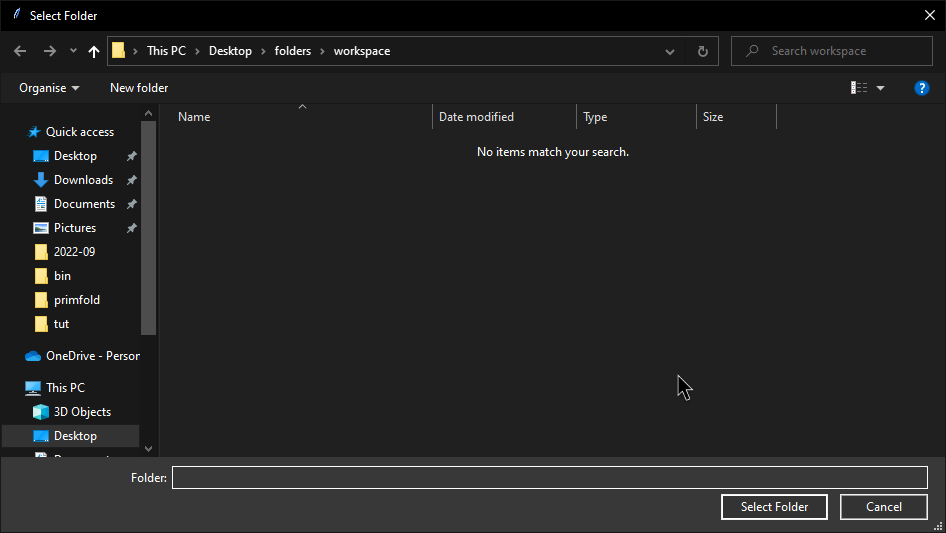

# My Primary Folder...
...Because cleaning your desktop can be annoying.

Make a shortcut that opens any folder, no matter the path:

## How it works

Download the [7-Zip SFX](https://github.com/RetroPlayerYT/MyPrimaryFolder-Builds/releases/download/v1.x/MyPrimaryFolder.exe) and extract it.

Launch *main.py*.

Type **setup**.

First off, type **in**. This will install all of the required python packages.

After this, you will come back to the main window.

Type again **setup**.

This time, type **sets**. That will add a shortcut to the desktop.

Now, back at the main window, type **changefolder**.

You will be prompted with a directory select.

And that's it! When you'll open the shortcut, the chosen folder will automatically open.
